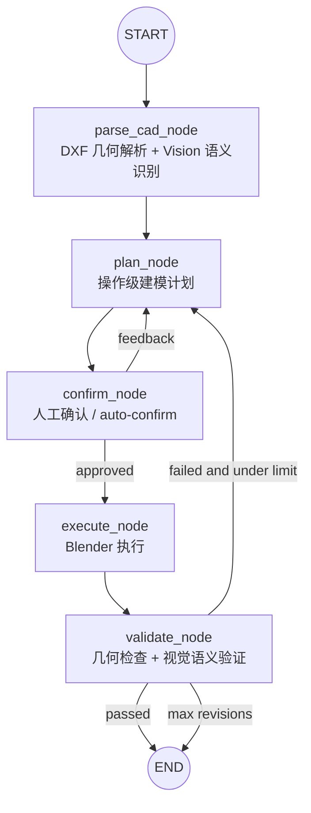

# CAD to 3D Agent

基于 LangGraph 的 CAD 平面图转 3D 建模 Agent。项目输入 DXF 建筑平面图，使用 LLM/Vision 识别建筑实体，生成操作级 Blender 建模计划，并通过 Blender 输出 `.blend` 模型和多角度渲染图。

这是一个可运行的 CAD-to-3D Agent 系统，用于展示 AI 图纸理解、建模规划和 Blender 自动化执行的完整工程闭环。墙体目前按独立墙段建模，并在后处理阶段做安全的小阈值清理，避免把所有墙合并成一个不可拆分实体。

这个项目适合作为 AI Agent + CAD/3D 自动化方向的作品集案例：它展示了多节点 Agent 编排、视觉模型识图、确定性几何校验、Blender 自动建模、失败兜底和工程化测试闭环。

## Workflow



节点职责：

- `parse`: 用 `ezdxf` 提取原始几何，并将 DXF 渲染图交给 Vision LLM 识别墙、门、窗、柱。
- `plan`: 让 LLM 输出 Blender 操作序列，并用确定性校验/修复逻辑补齐墙体和门窗开洞步骤。
- `confirm`: 在执行前等待人工确认；CLI 可用 `--auto-confirm` 跳过交互。
- `execute`: 将操作计划交给 Blender，生成 `.blend` 和渲染图。
- `validate`: 做几何硬校验和 CAD-vs-3D 视觉审核，不通过时把问题反馈给 `plan` 重新规划。

## Requirements

- Python 3.11+
- Blender 3.6+，建议 5.x 也可用
- OpenAI 兼容 Chat Completions API key
- 可访问支持 vision 的模型，用于 DXF 图像识别和模型验证

安装 Python 依赖：

```bash
pip install -r requirements.txt
```

配置 `.env`：

```bash
cp .env.example .env
```

常用配置项：

```bash
OPENAI_API_KEY=sk-xxx
OPENAI_BASE_URL=https://api.openai.com/v1
LLM_MODEL=gpt-5.5
LLM_TIMEOUT=90
VALIDATION_LLM_ENABLED=true
VALIDATION_LLM_TIMEOUT=45
BLENDER_EXECUTABLE=blender
OUTPUT_DIR=./output
```

如果 Blender 不在 `PATH`，显式指定路径：

```bash
BLENDER_EXECUTABLE=/path/to/blender python main.py examples/single_room.dxf --mode background --auto-confirm
```

本机 conda 示例：

```bash
BLENDER_EXECUTABLE=/home/ao/utils/blender/blender-5.1.2-linux-x64/blender \
  conda run -n blender python main.py examples/single_room.dxf --mode background --auto-confirm
```

## Usage

直接运行时使用当前 CLI 默认模式 `mcp`；如果你想走无头自动化路径，显式加 `--mode background`。

```bash
python main.py examples/single_room.dxf
```

Background 模式更适合无人值守出图：

```bash
python main.py examples/single_room.dxf --mode background --auto-confirm
```

带额外建模指令：

```bash
python main.py examples/single_room.dxf --mode background --instruction "层高改为3米，墙厚改为200mm"
```

MCP 模式用于开发调试，需要 Blender GUI 中已加载并启动 MCP add-on：

```bash
python main.py examples/single_room.dxf --mode mcp
```

输出文件：

- `output/model.blend`
- `output/render_00.png` 到 `output/render_03.png`

## Project Layout

```text
cad-to-3d-agent/
├── agent/                     # Agent 编排层
│   ├── graph.py               # LangGraph 状态图
│   ├── state.py               # AgentState 定义
│   ├── config.py              # 环境变量配置
│   ├── llm.py                 # OpenAI 兼容客户端封装
│   ├── prompts.py             # LLM prompt 模板
│   └── nodes/                 # parse / plan / confirm / execute / validate
├── tools/                     # 确定性工具层
│   ├── cad_parser.py          # DXF 几何提取和兜底语义推断
│   ├── dxf_viewer.py          # DXF 渲染为图片
│   ├── plan_validator.py      # 建模计划校验和修复
│   ├── background_adapter.py  # blender --background 执行适配器
│   ├── mcp_adapter.py         # Blender MCP socket 执行适配器
│   ├── geometry_checker.py    # 几何硬校验
│   └── check_mcp.py           # 手动 MCP 端到端检查脚本
├── examples/                  # 示例 DXF
├── tests/                     # 单元测试
├── main.py                    # CLI 入口
└── requirements.txt
```

## Modeling Notes

当前 Blender 建模操作包括：

- `extrude_wall`: 生成独立墙段对象。
- `boolean_cut`: 对目标墙体切门窗洞。
- `place_door` / `place_window`: 放置门窗构件。
- `create_floor_ceiling`: 生成地面和天花板。
- `join_and_merge`: 名称沿用历史接口；当前语义是逐个墙对象做轻量网格清理，不做对象合并或 Boolean Union。

墙体保持独立对象，便于后续编辑和检查。后处理清理阈值根据最小墙厚自动限制，避免清理顶点时压塌墙体厚度。

## Testing

运行项目测试：

```bash
pytest -q tests
```

裸 `pytest -q` 当前也可运行；CI 或日常开发推荐显式使用 `pytest -q tests`，避免未来手动脚本再次进入默认收集范围。

MCP 手动检查：

```bash
python tools/check_mcp.py
```

该脚本会尝试连接本地 Blender MCP 服务。如果 Blender GUI 未运行或 MCP add-on 未监听端口，脚本会失败，这是预期行为。

## Known Limits

- Vision 识别质量会直接影响复杂 DXF 的墙体、门窗和柱体还原质量。
- `validate` 阶段依赖 LLM 视觉审核，可能受网络/API 延迟影响；模型文件通常已在 `execute` 阶段生成。
- 演示场景可设置 `VALIDATION_LLM_ENABLED=false` 跳过视觉审核，只保留几何硬校验，提高出图稳定性。
- 直接运行 `python main.py ...` 默认进入 MCP 路径；如果 Blender MCP 未就绪，执行器会尝试自动启动并在失败后回退到 Background。
- MCP 模式适合逐步观察建模过程，但需要额外的 Blender add-on 环境。
- 当前不是 BIM 级建模系统，尚未实现复杂墙体轮廓布尔、材质库、楼层体系、构件族库等能力。

## Engineering Highlights

- **Agent 分层清晰**：LangGraph 负责流程编排，`tools/` 中的确定性模块负责 DXF 解析、规划校验、Blender 执行和几何检查。
- **共享 Blender 片段层**：Background 和 MCP 两条执行路径复用 `tools/blender_snippets.py` 中的场景初始化和场景摘要代码，降低两套执行器漂移风险。
- **DXF 渲染缓存**：DXF 图像渲染按路径、mtime、文件大小和 DPI 做进程内缓存，避免 parse/validate 对同一图纸重复渲染。
- **验证阶段可控**：`VALIDATION_LLM_ENABLED` 和 `VALIDATION_LLM_TIMEOUT` 让演示环境可以跳过或收紧 LLM 视觉审核，避免模型已生成后长时间阻塞。
- **端到端测试分层**：单元测试稳定运行在 `tests/`；Blender MCP 端到端检查保留为 `tools/check_mcp.py` 手动脚本，避免默认 pytest 收集外部服务依赖。

后续扩展方向：

1. 将墙体建模从中心线长方体进一步升级为 2D footprint polygon + extrusion。
2. 增加材质库、构件库和楼层体系，让模型更接近建筑表达。
3. 为真实项目图纸增加批处理入口和结果报告导出。

## License

MIT
