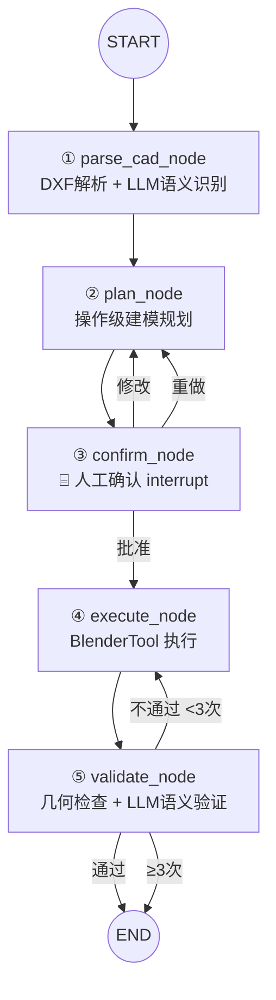

# CAD 图纸 → 3D 模型 AI Agent

一个基于 LangGraph 的 AI Agent，接收 DXF 建筑平面图，通过 LLM（GPT-5.5）自主理解图纸内容、规划建模步骤、调用 Blender 自动生成三维建筑模型。

## 一句话概述

> 输入一张建筑平面图（DXF），AI Agent 自动完成：理解图纸 → 规划建模步骤 → 人工确认 → 执行建模 → 验证修正 → 输出 .blend 三维模型。

## 工作流架构



## 快速开始

### 前提条件

- Python 3.11+
- Blender 3.6+（已加入 PATH）
- OpenAI 兼容 API key（如 GPT-5.5）

### 安装

```bash
git clone <repo-url>
cd cad-to-3d-agent
pip install -r requirements.txt
cp .env.example .env
# 编辑 .env 填入你的 API key
```

### 运行

```bash
# Background 模式（推荐，完全自动化）
python main.py examples/single_room.dxf

# MCP 模式（需要先启动 Blender 并加载 MCP add-on）
python main.py examples/single_room.dxf --mode mcp

# 带额外指令
python main.py examples/single_room.dxf --instruction "层高改为3米"
```

### 输出

- `output/model.blend` — Blender 三维模型文件
- `output/render_*.png` — 多角度渲染图

## 项目结构

```
cad-to-3d-agent/
├── agent/                     # Agent 核心层
│   ├── graph.py               # LangGraph 状态图定义
│   ├── state.py               # AgentState 类型
│   ├── config.py              # 配置管理
│   ├── llm.py                 # LLM 客户端封装
│   ├── prompts.py             # 所有 LLM prompt 模板
│   └── nodes/                 # 5 个节点
│       ├── parse.py           # ① DXF解析 + LLM语义识别
│       ├── plan.py            # ② 操作级建模规划
│       ├── confirm.py         # ③ 人工确认 (LangGraph interrupt)
│       ├── execute.py         # ④ 建模执行 (双模式)
│       └── validate.py        # ⑤ 双层验证 (几何+语义)
├── tools/                     # 工具层
│   ├── blender_tool.py        # BlenderTool 抽象接口
│   ├── background_adapter.py  # Background 模式适配器
│   ├── mcp_adapter.py         # MCP 模式适配器
│   ├── cad_parser.py          # ezdxf 几何提取
│   └── geometry_checker.py    # 几何一致性验证
├── examples/                  # 示例 DXF 文件
├── tests/                     # 测试
├── main.py                    # CLI 入口
└── README.md
```

## 设计决策记录

### 为什么 5 个节点？

5 个节点对应 Agent 处理 CAD→3D 任务的 5 个独立阶段。每个节点有单一的职责和明确的输入/输出边界：
1. **parse** — 只负责"图纸里有什么"
2. **plan** — 只负责"怎么建"
3. **confirm** — 只负责"人对不对"
4. **execute** — 只负责"建出来"
5. **validate** — 只负责"建对了没有"

拆分的好处：每个节点可独立测试、独立调试、独立升级（如 parse 从 ezdxf 升级到 VLM 解析）。

### 为什么操作级规划而不是语义级？

LLM 直接输出 `{operation: "extrude_wall", params: {start: [0,0], end: [5,0], height: 2.8}}` 而不是 `"建一面5米长的南墙"`。两个原因：
1. 省去"语义→bpy"的翻译层，减少出错和延迟
2. 操作序列是 LLM 推理过程的可视化——面试官可以直接看到 Agent 的"思考"

### 为什么双模式执行？

- **Background 模式**（默认）：`pip install && python main.py` 即跑，不需要用户打开 Blender
- **MCP 模式**：开发调试用——逐步观察每个建模操作的执行结果

两种模式共享同一套 BlenderTool 抽象接口，Agent 代码完全不知自己在用什么模式。

### 为什么验证用两层而不是纯 LLM？

- **第一层**（几何硬校验）：确定性代码，检查实体数量/尺寸/位置。LLM 不会"算错"但代码会，所以这层必须是确定性代码
- **第二层**（LLM 语义验证）：检查合理性问题——"这个房间有门没窗"、"墙体 24mm 太薄"。这些问题需要建筑领域的常识

两层互补：硬检查保证不遗漏，软检查保证不荒谬。

## 模型配置

在 `.env` 中配置：

```bash
OPENAI_API_KEY=sk-xxx          # 你的 API key
OPENAI_BASE_URL=https://...     # API 地址
LLM_MODEL=gpt-5.5               # 模型名称
```

支持任何 OpenAI 兼容接口，可切换 Claude、DeepSeek、Qwen 等。

## 许可

MIT
